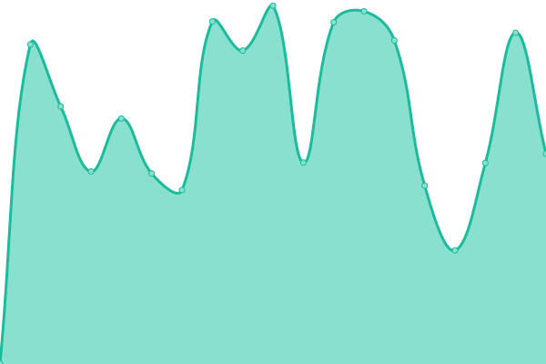

# [📈 Live Status](https://streamlined-scs.github.io/upptime): <!--live status--> **🟧 Partial outage**

This repository contains the open-source uptime monitor and status page for [streamlined-scs](https://streamlined-scs.github.io/upptime), powered by [Upptime](https://github.com/upptime/upptime).

With [Upptime](https://upptime.js.org), you can get your own unlimited and free uptime monitor and status page, powered entirely by a GitHub repository. We use [Issues](https://github.com/streamlined-scs/upptime/issues) as incident reports, [Actions](https://github.com/streamlined-scs/upptime/actions) as uptime monitors, and [Pages](https://streamlined-scs.github.io/upptime) for the status page.

<!--start: status pages-->
<!-- This summary is generated by Upptime (https://github.com/upptime/upptime) -->
<!-- Do not edit this manually, your changes will be overwritten -->
<!-- prettier-ignore -->
| URL | Status | History | Response Time | Uptime |
| --- | ------ | ------- | ------------- | ------ |
|  [Pagina Web Streamlined](https://streamlined.cl) | 🟩 Up | [pagina-web-streamlined.yml](https://github.com/streamlined-scs/upptime/commits/HEAD/history/pagina-web-streamlined.yml) | 

 1865ms
     
 | 

<a href="https://streamlined-scs.github.io/upptime/history/pagina-web-streamlined">97.88%</a>
    

|  [Central Telefonica Streamlined](https://freepbx.streamlined-scs.cl/admin/config.php) | 🟥 Down | [central-telefonica-streamlined.yml](https://github.com/streamlined-scs/upptime/commits/HEAD/history/central-telefonica-streamlined.yml) | 

 1021ms
     
 | 

<a href="https://streamlined-scs.github.io/upptime/history/central-telefonica-streamlined">99.53%</a>
    

|  [NAS Streamlined](https://nas.streamlined-scs.cl) | 🟥 Down | [nas-streamlined.yml](https://github.com/streamlined-scs/upptime/commits/HEAD/history/nas-streamlined.yml) | 

 939ms
     
 | 

<a href="https://streamlined-scs.github.io/upptime/history/nas-streamlined">99.94%</a>
    

|  [Workspace Streamlined](https://workspace.streamlined-scs.cl) | 🟥 Down | [workspace-streamlined.yml](https://github.com/streamlined-scs/upptime/commits/HEAD/history/workspace-streamlined.yml) | 

 1701ms
     
 | 

<a href="https://streamlined-scs.github.io/upptime/history/workspace-streamlined">99.95%</a>
    

|  [SMGI Metabase Streamlined](https://mgi.streamlined-scs.cl) | 🟥 Down | [smgi-metabase-streamlined.yml](https://github.com/streamlined-scs/upptime/commits/HEAD/history/smgi-metabase-streamlined.yml) | 

 992ms
     
 | 

<a href="https://streamlined-scs.github.io/upptime/history/smgi-metabase-streamlined">99.95%</a>
    

|  [GITLAB Streamlined](https://gitlab.streamlined-scs.cl/users/sign_in) | 🟥 Down | [gitlab-streamlined.yml](https://github.com/streamlined-scs/upptime/commits/HEAD/history/gitlab-streamlined.yml) | 

 868ms
     
 | 

<a href="https://streamlined-scs.github.io/upptime/history/gitlab-streamlined">99.96%</a>
    

|  [SMGI Grafana Streamlined](https://smgi.streamlined-scs.cl/login) | 🟥 Down | [smgi-grafana-streamlined.yml](https://github.com/streamlined-scs/upptime/commits/HEAD/history/smgi-grafana-streamlined.yml) | 

 3519ms
     
 | 

<a href="https://streamlined-scs.github.io/upptime/history/smgi-grafana-streamlined">0.00%</a>
    

|  [EAM Cencosud](https://eam.cencosud.com/web/base/logindisp?tenant=SCSPROD) | 🟩 Up | [eam-cencosud.yml](https://github.com/streamlined-scs/upptime/commits/HEAD/history/eam-cencosud.yml) | 

 630ms
     
 | 

<a href="https://streamlined-scs.github.io/upptime/history/eam-cencosud">100.00%</a>
    

|  [EAM Maara](http://eam.maaracorp.com:8081/web/base/logindisp?tenant=EAM) | 🟩 Up | [eam-maara.yml](https://github.com/streamlined-scs/upptime/commits/HEAD/history/eam-maara.yml) | 

 153ms
     
 | 

<a href="https://streamlined-scs.github.io/upptime/history/eam-maara">100.00%</a>
    

|  [EAM Blumar](http://eam.blumar.com/web/base/logindisp?tenant=EAMPROD) | 🟩 Up | [eam-blumar.yml](https://github.com/streamlined-scs/upptime/commits/HEAD/history/eam-blumar.yml) | 

 733ms
     
 | 

<a href="https://streamlined-scs.github.io/upptime/history/eam-blumar">100.00%</a>
    

|  [SEAM Dreams](https://seam-md.streamlined-scs.cl) | 🟥 Down | [seam-dreams.yml](https://github.com/streamlined-scs/upptime/commits/HEAD/history/seam-dreams.yml) | 

 462ms
     
 | 

<a href="https://streamlined-scs.github.io/upptime/history/seam-dreams">99.97%</a>
    

|  [SEAM Highlift](https://seam-hl.streamlined-scs.cl) | 🟥 Down | [seam-highlift.yml](https://github.com/streamlined-scs/upptime/commits/HEAD/history/seam-highlift.yml) | 

 433ms
     
 | 

<a href="https://streamlined-scs.github.io/upptime/history/seam-highlift">99.97%</a>
    

|  [SEAM Grupo America](https://seam-ga.streamlined-scs.cl) | 🟥 Down | [seam-grupo-america.yml](https://github.com/streamlined-scs/upptime/commits/HEAD/history/seam-grupo-america.yml) | 

 445ms
     
 | 

<a href="https://streamlined-scs.github.io/upptime/history/seam-grupo-america">99.98%</a>
    

|  [WSDL SAM Highlift](https://wsdl-hl.streamlined-scs.cl/api/Scsdocumentos/getLogo) | 🟥 Down | [wsdl-sam-highlift.yml](https://github.com/streamlined-scs/upptime/commits/HEAD/history/wsdl-sam-highlift.yml) | 

 444ms
     
 | 

<a href="https://streamlined-scs.github.io/upptime/history/wsdl-sam-highlift">99.98%</a>
    

|  [WSDL SAM Grupo America](https://wsdl-ga.streamlined-scs.cl/api/Scsdocumentos/getLogo) | 🟥 Down | [wsdl-sam-grupo-america.yml](https://github.com/streamlined-scs/upptime/commits/HEAD/history/wsdl-sam-grupo-america.yml) | 

 443ms
     
 | 

<a href="https://streamlined-scs.github.io/upptime/history/wsdl-sam-grupo-america">99.99%</a>
    

|  [WSDL SAM Dreams](https://wsdl-md.streamlined-scs.cl/api/Scsdocumentos/getLogo) | 🟥 Down | [wsdl-sam-dreams.yml](https://github.com/streamlined-scs/upptime/commits/HEAD/history/wsdl-sam-dreams.yml) | 

 467ms
     
 | 

<a href="https://streamlined-scs.github.io/upptime/history/wsdl-sam-dreams">99.99%</a>
    

|  [WSDL Maara Mobile SAT](http://eam.maaracorp.com:8083/WsseamSAT/WSEAMC/ws/ObtenerOrdenesdetrabajo?EVT_PERSON=4205) | 🟩 Up | [wsdl-maara-mobile-sat.yml](https://github.com/streamlined-scs/upptime/commits/HEAD/history/wsdl-maara-mobile-sat.yml) | 

 166ms
     
 | 

<a href="https://streamlined-scs.github.io/upptime/history/wsdl-maara-mobile-sat">100.00%</a>
    

|  [WSDL Cencosud Mobile SAM](https://seam.cencosud.com/WsseamPROD/WSEAMC/ws/ObtenerEquipos?OBJ_MRC=E585&OBJ_ESPE=TV) | 🟩 Up | [wsdl-cencosud-mobile-sam.yml](https://github.com/streamlined-scs/upptime/commits/HEAD/history/wsdl-cencosud-mobile-sam.yml) | 

 586ms
     
 | 

<a href="https://streamlined-scs.github.io/upptime/history/wsdl-cencosud-mobile-sam">100.00%</a>
    

|  [WSDL Cencosud Reportes](https://seam.cencosud.com/birt/frameset?__report=SCS_reporte_orden_compra_prod.rptdesign&__format=PDF&ORDERCODE=235883) | 🟩 Up | [wsdl-cencosud-reportes.yml](https://github.com/streamlined-scs/upptime/commits/HEAD/history/wsdl-cencosud-reportes.yml) | 

 436ms
     
 | 

<a href="https://streamlined-scs.github.io/upptime/history/wsdl-cencosud-reportes">100.00%</a>
    

|  [Meet Jitsi Streamlined](https://jitsi.streamlined-scs.cl) | 🟥 Down | [meet-jitsi-streamlined.yml](https://github.com/streamlined-scs/upptime/commits/HEAD/history/meet-jitsi-streamlined.yml) | 

 1064ms
     
 | 

<a href="https://streamlined-scs.github.io/upptime/history/meet-jitsi-streamlined">99.47%</a>
    

<!--end: status pages-->

[**Visit our status website →**](https://streamlined-scs.github.io/upptime)

## 📄 License

- Powered by: [Upptime](https://github.com/upptime/upptime)
- Code: [MIT](./LICENSE) © [streamlined-scs](https://streamlined-scs.github.io/upptime)
- Data in the `./history` directory: [Open Database License](https://opendatacommons.org/licenses/odbl/1-0/)
