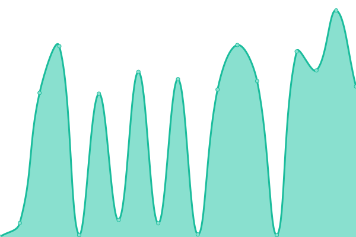

# [📈 Live Status](https://streamlined-scs.github.io/upptime): <!--live status--> **🟧 Partial outage**

This repository contains the open-source uptime monitor and status page for [streamlined-scs](https://streamlined-scs.github.io/upptime), powered by [Upptime](https://github.com/upptime/upptime).

With [Upptime](https://upptime.js.org), you can get your own unlimited and free uptime monitor and status page, powered entirely by a GitHub repository. We use [Issues](https://github.com/streamlined-scs/upptime/issues) as incident reports, [Actions](https://github.com/streamlined-scs/upptime/actions) as uptime monitors, and [Pages](https://streamlined-scs.github.io/upptime) for the status page.

<!--start: status pages-->
<!-- This summary is generated by Upptime (https://github.com/upptime/upptime) -->
<!-- Do not edit this manually, your changes will be overwritten -->
<!-- prettier-ignore -->
| URL | Status | History | Response Time | Uptime |
| --- | ------ | ------- | ------------- | ------ |
|  [SAM VTR](https://seam.vtr.cl/obtenerListadoActividades?wsdl) | 🟩 Up | [sam-vtr.yml](https://github.com/streamlined-scs/upptime/commits/HEAD/history/sam-vtr.yml) | 

 862ms
     
 | 

<a href="https://streamlined-scs.github.io/upptime/history/sam-vtr">100.00%</a>
    

|  [EAM Cencosud](https://eam.cencosud.com/web/base/logindisp?tenant=SCSPROD) | 🟩 Up | [eam-cencosud.yml](https://github.com/streamlined-scs/upptime/commits/HEAD/history/eam-cencosud.yml) | 

 307ms
     
 | 

<a href="https://streamlined-scs.github.io/upptime/history/eam-cencosud">100.00%</a>
    

|  [SPP Cencosud](https://seam.cencosud.com/eam/auth/login) | 🟩 Up | [spp-cencosud.yml](https://github.com/streamlined-scs/upptime/commits/HEAD/history/spp-cencosud.yml) | 

 1754ms
     
 | 

<a href="https://streamlined-scs.github.io/upptime/history/spp-cencosud">99.78%</a>
    

|  [EAM Blumar AWS](https://eambl.blumar.com/web/base/logindisp?tenant=EAMTEST) | 🟥 Down | [eam-blumar-aws.yml](https://github.com/streamlined-scs/upptime/commits/HEAD/history/eam-blumar-aws.yml) | 

 0ms
     
 | 

<a href="https://streamlined-scs.github.io/upptime/history/eam-blumar-aws">0.00%</a>
    

|  [EAM Maara](http://eam.maaracorp.com:8081/web/base/logindisp?tenant=EAM) | 🟩 Up | [eam-maara.yml](https://github.com/streamlined-scs/upptime/commits/HEAD/history/eam-maara.yml) | 

 86ms
     
 | 

<a href="https://streamlined-scs.github.io/upptime/history/eam-maara">100.00%</a>
    

|  [EAM10 Blumar](http://eam.blumar.com/web/base/logindisp?tenant=EAMPROD) | 🟩 Up | [eam-10-blumar.yml](https://github.com/streamlined-scs/upptime/commits/HEAD/history/eam-10-blumar.yml) | 

 676ms
     
 | 

<a href="https://streamlined-scs.github.io/upptime/history/eam-10-blumar">99.82%</a>
    

|  [SEAM Dreams](https://seam-md.streamlined-app.io) | 🟩 Up | [seam-dreams.yml](https://github.com/streamlined-scs/upptime/commits/HEAD/history/seam-dreams.yml) | 

 499ms
     
 | 

<a href="https://streamlined-scs.github.io/upptime/history/seam-dreams">100.00%</a>
    

|  [SEAM Highlift](https://seam-hl.streamlined-app.io) | 🟩 Up | [seam-highlift.yml](https://github.com/streamlined-scs/upptime/commits/HEAD/history/seam-highlift.yml) | 

 466ms
     
 | 

<a href="https://streamlined-scs.github.io/upptime/history/seam-highlift">100.00%</a>
    

|  [SEAM Grupo America](https://seam-ga.streamlined-app.io) | 🟩 Up | [seam-grupo-america.yml](https://github.com/streamlined-scs/upptime/commits/HEAD/history/seam-grupo-america.yml) | 

 482ms
     
 | 

<a href="https://streamlined-scs.github.io/upptime/history/seam-grupo-america">100.00%</a>
    

|  [SEAM Report SEAM PROD](https://seam-rpt.streamlined-app.io/birt/frameset?__report=Scs_orden_trabajo_cliente.rptdesign&__format=PDF) | 🟩 Up | [seam-report-seam-prod.yml](https://github.com/streamlined-scs/upptime/commits/HEAD/history/seam-report-seam-prod.yml) | 

 718ms
     
 | 

<a href="https://streamlined-scs.github.io/upptime/history/seam-report-seam-prod">100.00%</a>
    

|  [WSDL SAM Highlift](https://wsdl-hl.streamlined-app.io/api/Scsdocumentos/getLogo) | 🟩 Up | [wsdl-sam-highlift.yml](https://github.com/streamlined-scs/upptime/commits/HEAD/history/wsdl-sam-highlift.yml) | 

 495ms
     
 | 

<a href="https://streamlined-scs.github.io/upptime/history/wsdl-sam-highlift">100.00%</a>
    

|  [WSDL SAM Grupo America](https://wsdl-ga.streamlined-app.io/api/Scsdocumentos/getLogo) | 🟩 Up | [wsdl-sam-grupo-america.yml](https://github.com/streamlined-scs/upptime/commits/HEAD/history/wsdl-sam-grupo-america.yml) | 

 491ms
     
 | 

<a href="https://streamlined-scs.github.io/upptime/history/wsdl-sam-grupo-america">100.00%</a>
    

|  [WSDL SAM Dreams](https://wsdl-md.streamlined-app.io/api/Scsdocumentos/getLogo) | 🟩 Up | [wsdl-sam-dreams.yml](https://github.com/streamlined-scs/upptime/commits/HEAD/history/wsdl-sam-dreams.yml) | 

 486ms
     
 | 

<a href="https://streamlined-scs.github.io/upptime/history/wsdl-sam-dreams">100.00%</a>
    

|  [WSDL Maara Mobile SAT](http://eam.maaracorp.com:8083/WsseamSAT/WSEAMC/ws/ObtenerOrdenesdetrabajo?EVT_PERSON=4205) | 🟩 Up | [wsdl-maara-mobile-sat.yml](https://github.com/streamlined-scs/upptime/commits/HEAD/history/wsdl-maara-mobile-sat.yml) | 

 118ms
     
 | 

<a href="https://streamlined-scs.github.io/upptime/history/wsdl-maara-mobile-sat">100.00%</a>
    

|  [WSDL Cencosud Mobile SAM](https://seam.cencosud.com/WsseamPROD/WSEAMC/ws/ObtenerEquipos?OBJ_MRC=E585&OBJ_ESPE=TV) | 🟩 Up | [wsdl-cencosud-mobile-sam.yml](https://github.com/streamlined-scs/upptime/commits/HEAD/history/wsdl-cencosud-mobile-sam.yml) | 

 3181ms
     
 | 

<a href="https://streamlined-scs.github.io/upptime/history/wsdl-cencosud-mobile-sam">99.52%</a>
    

|  [WSDL Cencosud Reportes](https://seam.cencosud.com/birt/frameset?__report=SCS_reporte_orden_compra_prod.rptdesign&__format=PDF&ORDERCODE=235883) | 🟩 Up | [wsdl-cencosud-reportes.yml](https://github.com/streamlined-scs/upptime/commits/HEAD/history/wsdl-cencosud-reportes.yml) | 

 989ms
     
 | 

<a href="https://streamlined-scs.github.io/upptime/history/wsdl-cencosud-reportes">94.18%</a>
    

|  [Pagina Web Streamlined](https://streamlined.cl) | 🟩 Up | [pagina-web-streamlined.yml](https://github.com/streamlined-scs/upptime/commits/HEAD/history/pagina-web-streamlined.yml) | 

 1321ms
     
 | 

<a href="https://streamlined-scs.github.io/upptime/history/pagina-web-streamlined">100.00%</a>
    

|  [Correo Streamlined](https://www.streamlined.cl/webmail/log-in) | 🟩 Up | [correo-streamlined.yml](https://github.com/streamlined-scs/upptime/commits/HEAD/history/correo-streamlined.yml) | 

 531ms
     
 | 

<a href="https://streamlined-scs.github.io/upptime/history/correo-streamlined">100.00%</a>
    

|  [Central Telefonica Streamlined](https://freepbx.streamlined-scs.cl/admin/config.php) | 🟩 Up | [central-telefonica-streamlined.yml](https://github.com/streamlined-scs/upptime/commits/HEAD/history/central-telefonica-streamlined.yml) | 

 573ms
     
 | 

<a href="https://streamlined-scs.github.io/upptime/history/central-telefonica-streamlined">100.00%</a>
    

|  [NAS Streamlined](https://nas.streamlined-scs.cl) | 🟩 Up | [nas-streamlined.yml](https://github.com/streamlined-scs/upptime/commits/HEAD/history/nas-streamlined.yml) | 

 895ms
     
 | 

<a href="https://streamlined-scs.github.io/upptime/history/nas-streamlined">100.00%</a>
    

|  [Workspace Streamlined](https://workspace.streamlined-scs.cl) | 🟥 Down | [workspace-streamlined.yml](https://github.com/streamlined-scs/upptime/commits/HEAD/history/workspace-streamlined.yml) | 

 1261ms
     
 | 

<a href="https://streamlined-scs.github.io/upptime/history/workspace-streamlined">99.99%</a>
    

|  [SMGI Metabase Streamlined](https://mgi.streamlined-scs.cl) | 🟩 Up | [smgi-metabase-streamlined.yml](https://github.com/streamlined-scs/upptime/commits/HEAD/history/smgi-metabase-streamlined.yml) | 

 1092ms
     
 | 

<a href="https://streamlined-scs.github.io/upptime/history/smgi-metabase-streamlined">100.00%</a>
    

|  [GITLAB Streamlined](https://gitlab.streamlined-scs.cl/users/sign_in) | 🟩 Up | [gitlab-streamlined.yml](https://github.com/streamlined-scs/upptime/commits/HEAD/history/gitlab-streamlined.yml) | 

 766ms
     
 | 

<a href="https://streamlined-scs.github.io/upptime/history/gitlab-streamlined">100.00%</a>
    

|  [WIKI SCS Streamlined](https://wikijs.streamlined-scs.cl/login) | 🟩 Up | [wiki-scs-streamlined.yml](https://github.com/streamlined-scs/upptime/commits/HEAD/history/wiki-scs-streamlined.yml) | 

 453ms
     
 | 

<a href="https://streamlined-scs.github.io/upptime/history/wiki-scs-streamlined">100.00%</a>
    

|  [Meet Jitsi Streamlined](https://jitsi.streamlined-scs.cl) | 🟩 Up | [meet-jitsi-streamlined.yml](https://github.com/streamlined-scs/upptime/commits/HEAD/history/meet-jitsi-streamlined.yml) | 

 729ms
     
 | 

<a href="https://streamlined-scs.github.io/upptime/history/meet-jitsi-streamlined">100.00%</a>
    

|  [Element Streamlined](https://element.streamlined-scs.cl/) | 🟩 Up | [element-streamlined.yml](https://github.com/streamlined-scs/upptime/commits/HEAD/history/element-streamlined.yml) | 

 460ms
     
 | 

<a href="https://streamlined-scs.github.io/upptime/history/element-streamlined">100.00%</a>
    

|  [Matrix Streamlined](https://matrix.streamlined-scs.cl) | 🟩 Up | [matrix-streamlined.yml](https://github.com/streamlined-scs/upptime/commits/HEAD/history/matrix-streamlined.yml) | 

 703ms
     
 | 

<a href="https://streamlined-scs.github.io/upptime/history/matrix-streamlined">100.00%</a>
    

|  [SEAM SCS Demo](https://seam-demo.streamlined-scs.cl/web/base/logindisp?tenant=SEAMXIII) | 🟩 Up | [seam-scs-demo.yml](https://github.com/streamlined-scs/upptime/commits/HEAD/history/seam-scs-demo.yml) | 

 500ms
     
 | 

<a href="https://streamlined-scs.github.io/upptime/history/seam-scs-demo">100.00%</a>
    

|  [WSDL SAM SCS Demo](https://wsdl-demo.streamlined-scs.cl/api/Scssalidabodega/getcontadorsalidabodega) | 🟩 Up | [wsdl-sam-scs-demo.yml](https://github.com/streamlined-scs/upptime/commits/HEAD/history/wsdl-sam-scs-demo.yml) | 

 476ms
     
 | 

<a href="https://streamlined-scs.github.io/upptime/history/wsdl-sam-scs-demo">100.00%</a>
    

|  [SEAMX SCS Desa](https://seam-admin-dev.streamlined-scs.cl/auth/login) | 🟩 Up | [seamx-scs-desa.yml](https://github.com/streamlined-scs/upptime/commits/HEAD/history/seamx-scs-desa.yml) | 

 476ms
     
 | 

<a href="https://streamlined-scs.github.io/upptime/history/seamx-scs-desa">100.00%</a>
    

|  [EAM Maara Desa](https://maara.streamlined-scs.cl/web/base/logindisp?tenant=EAM) | 🟩 Up | [eam-maara-desa.yml](https://github.com/streamlined-scs/upptime/commits/HEAD/history/eam-maara-desa.yml) | 

 531ms
     
 | 

<a href="https://streamlined-scs.github.io/upptime/history/eam-maara-desa">92.40%</a>
    

|  [SAT Maara Desa](https://ws-sat.streamlined-scs.cl/WsseamSAT/WSEAMC/ws/ObtenerEmpleado?MRC_CODE=RG-FAJ) | 🟩 Up | [sat-maara-desa.yml](https://github.com/streamlined-scs/upptime/commits/HEAD/history/sat-maara-desa.yml) | 

 631ms
     
 | 

<a href="https://streamlined-scs.github.io/upptime/history/sat-maara-desa">92.41%</a>
    

|  [EAM Cencosud Desa](https://eam-cencodesa.streamlined-scs.cl/web/base/logindisp?tenant=SCSPROD) | 🟩 Up | [eam-cencosud-desa.yml](https://github.com/streamlined-scs/upptime/commits/HEAD/history/eam-cencosud-desa.yml) | 

 567ms
     
 | 

<a href="https://streamlined-scs.github.io/upptime/history/eam-cencosud-desa">100.00%</a>
    

|  [WSDL SAM Cencosud Desa](https://ws-cenco-sam.streamlined-scs.cl/WsseamPROD/WSEAMC/ws/ObtenerEquipos?OBJ_MRC=E585&OBJ_ESPE=TV) | 🟩 Up | [wsdl-sam-cencosud-desa.yml](https://github.com/streamlined-scs/upptime/commits/HEAD/history/wsdl-sam-cencosud-desa.yml) | 

 456ms
     
 | 

<a href="https://streamlined-scs.github.io/upptime/history/wsdl-sam-cencosud-desa">100.00%</a>
    

|  [SPP Cencosud Desa](https://spp-cenco.streamlined-scs.cl/auth/login) | 🟩 Up | [spp-cencosud-desa.yml](https://github.com/streamlined-scs/upptime/commits/HEAD/history/spp-cencosud-desa.yml) | 

 582ms
     
 | 

<a href="https://streamlined-scs.github.io/upptime/history/spp-cencosud-desa">100.00%</a>
    

<!--end: status pages-->

[**Visit our status website →**](https://streamlined-scs.github.io/upptime)

## 📄 License

- Powered by: [Upptime](https://github.com/upptime/upptime)
- Code: [MIT](./LICENSE) © [streamlined-scs](https://streamlined-scs.github.io/upptime)
- Data in the `./history` directory: [Open Database License](https://opendatacommons.org/licenses/odbl/1-0/)
